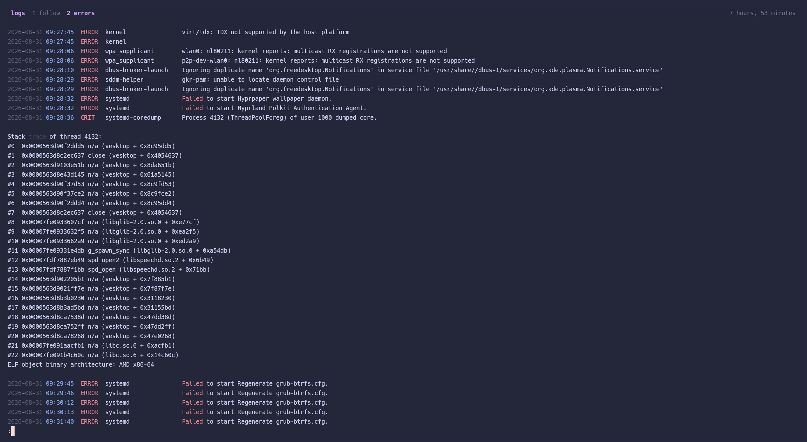
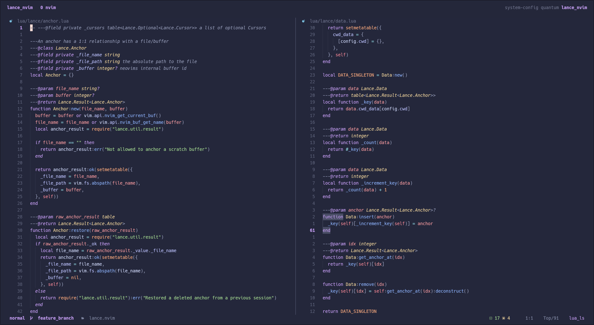
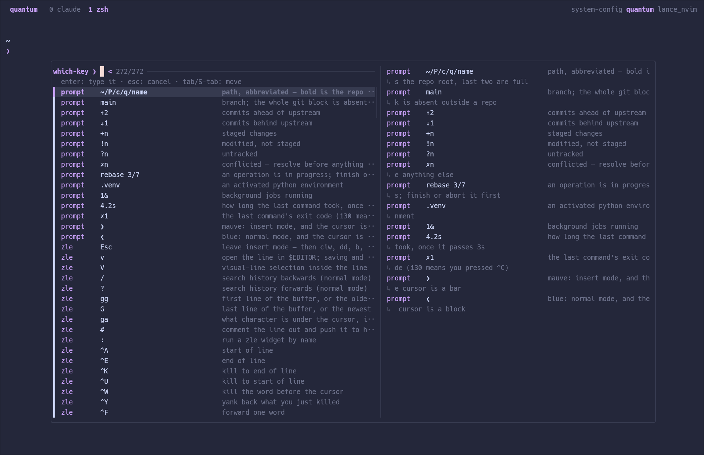

# System Configuration

Ansible playbook that provisions my CachyOS/Arch system config end to end, then
hands `$HOME` over to chezmoi.

## Separation of concerns

| Scope                                                  | Owner                                                    |
| ------------------------------------------------------ | -------------------------------------------------------- |
| `/etc`, system units, groups, bootloader, packages     | Ansible                                                  |
| `$HOME` dotfiles                                       | chezmoi                                                  |
| Interactive shell (`.zshrc`, `.zshenv`, `.lessfilter`) | Ansible (`roles/zsh`, templated)                         |
| External checkouts, themes, downloads (`$HOME`)        | Ansible (`roles/externals`)                              |
| Quickshell desktop shell (config symlink, completions) | Ansible (`roles/quickshell`, vendored)                   |
| Prompted values (profile, monitors, feature flags)     | Ansible → rendered into `~/.config/chezmoi/chezmoi.toml` |

chezmoi no longer prompts and no longer carries `.chezmoiscripts` or
`.chezmoiexternal`. All of it lives in `roles/`.

## Bootstrap a fresh machine

```sh
sudo pacman -S --needed ansible git
git clone git@codeberg.org:quantumfate/system-config.git
cd system-config
ansible-galaxy install -r requirements.yml
./bootstrap.sh            # == ansible-playbook site.yml --ask-become-pass
```

First run is interactive once: `pass-cli login` needs a TTY. Everything after
that is idempotent — re-run any time.

## Layout

```
site.yml                 role order, feature-flag gating
group_vars/all/main.yml  profile + feature flags + identity  ← edit this
group_vars/all/externals.yml  external repos/themes/downloads (ex-chezmoi externals)
group_vars/all/packages.yml  package sets per feature
inventory/hosts.yml      localhost, local connection
roles/                   one concern each
```

## Roles

| Role               | Description                                                                                                                                                                                     |
| ------------------ | ----------------------------------------------------------------------------------------------------------------------------------------------------------------------------------------------- |
| `base`             | system deps                                                                                                                                                                                     |
| `password_manager` | provides all secrets                                                                                                                                                                            |
| `secrets`          | key management                                                                                                                                                                                  |
| `packages`         | system packages                                                                                                                                                                                 |
| `sudoers`          | sudo configuration                                                                                                                                                                              |
| `user_dirs`        | xdg                                                                                                                                                                                             |
| `login_shell`      | zsh primary shell                                                                                                                                                                               |
| `keyboard`         | custom-dvorak layout                                                                                                                                                                            |
| `console`          | tty theming                                                                                                                                                                                     |
| `desktop_entries`  | sway and niri                                                                                                                                                                                   |
| `display_manager`  | system configuration for display-manager                                                                                                                                                        |
| `docker`           | infra tools                                                                                                                                                                                     |
| `virtualization`   | vms                                                                                                                                                                                             |
| `power_profile`    | performance related                                                                                                                                                                             |
| `devenv`           | neovim and dev dependencies                                                                                                                                                                     |
| `chezmoi`          | dotfiles clone + apply, systemd unit-reload                                                                                                                                                     |
| `externals`        | plugins, dev checkouts, catppuccin themes                                                                                                                                                       |
| `zsh`              | terminal surface: shell config, plugins, lessfilter, kitty, both tmux servers, logging workspace (templated; supersedes chezmoi for `.zshrc`/`.zshenv`/`.lessfilter`/`.tmux.conf`/`kitty.conf`) |
| `browser_profiles` | prowser profile settings                                                                                                                                                                        |
| `theming`          | GTK/Qt/cursor/browser theming — one flavour, one accent, one type scale (templated; supersedes chezmoi for the GTK, Qt, Kvantum, xsettingsd and Zen `user.js` files)                            |
| `yazi`             | file manager                                                                                                                                                                                    |

## Logging workspace

Structured logging centre in a separate tmux server.

### The pipeline



```
source ──▶ logstream ──▶ tspin ──▶ less -RS
           columns       colour     no wrap
```

Every journal source renders as the same fixed-width table:

```
YYYY-MM-DD HH:MM:SS  LEVEL   source                message…
└─ 19 ─────────────┘ └─ 5 ─┘ └─ 20 ───────────────┘
```

### Commands

| Command               | Source                                                      |
| --------------------- | ----------------------------------------------------------- |
| `log`                 | fzf picker: presets, uwsm apps, live units, workspace files |
| `log <spec>`          | open one source directly                                    |
| `logh <spec>`         | same, in the current terminal (no window)                   |
| `logu <unit>`         | one system unit, following                                  |
| `loguu <unit>`        | one `--user` unit, following                                |
| `logf <file>`         | a plain file, following                                     |
| `logerr` / `logwarn`  | this boot, by priority                                      |
| `logk`                | kernel ring buffer                                          |
| `logboot` / `logprev` | this boot / previous boot, from the top                     |
| `logaudit`            | audit and access denials                                    |
| `logwhy <unit>`       | state + last 50 lines, one screen                           |
| `loggrep <pat>`       | search this boot, same columns                              |
| `logsince <when>`     | a bounded window (`'15 min ago'`, `today`)                  |

### Tuning

All in `roles/zsh/defaults/main.yml`: `zsh_kitty_log_class`,
`zsh_tmux_log_socket`, `zsh_log_workdir`, `zsh_log_dir`, `zsh_log_font_size`,
`zsh_log_padding`, `zsh_log_line_height` (extra leading between rows),
`zsh_log_accent` (chrome only — severity colours stay semantic),
`zsh_tailspin_theme`, `zsh_bat_theme`. Severity colours live in
`roles/zsh/templates/tailspin_theme.toml.j2`, in the 16 ANSI names, because the
terminal palette already _is_ Macchiato.

## Terminal surface



## Interactive shell



## Desktop theming

Every toolkit needs telling separately, and the portals read none of those files:

| Layer   | File                                                             | Note                                                                                                |
| ------- | ---------------------------------------------------------------- | --------------------------------------------------------------------------------------------------- |
| GTK2    | `~/.gtkrc-2.0.mine`                                              | the `.mine` file, because nwg-look owns `~/.gtkrc-2.0`                                              |
| GTK3    | `~/.config/gtk-3.0/settings.ini`                                 |                                                                                                     |
| GTK4    | `settings.ini` + **symlinked** `gtk.css`/`gtk-dark.css`/`assets` | libadwaita ignores `gtk-theme-name` entirely                                                        |
| Qt      | `qt6ct.conf` / `qt5ct.conf` + Kvantum                            | fonts are QDataStream blobs, see `templates/_qtfont.j2`                                             |
| X11     | `xsettingsd.conf`                                                | XWayland clients                                                                                    |
| Portals | **dconf** `/org/gnome/desktop/interface/*`                       | what `xdg-desktop-portal-gtk` reports — miss this and the app is themed but its file chooser is not |
| Session | `~/.config/environment.d/50-theming.conf`                        | reaches every systemd user unit, which is how portal popups spawned without a shell get `XCURSOR_*` |

`templates/zen-user.js.j2` is deployed to harden and theme my browser.

```sh
ansible-playbook site.yml -t theming --ask-become-pass              # repo packages via pacman + become
sudo -v && ansible-playbook site.yml -t theming --ask-become-pass   # ...plus AUR, on a fresh machine
ansible-playbook site.yml -t theming --skip-tags privileged        # dotfiles only, no sudo at all
```

## Common runs

```sh
ansible-playbook site.yml --ask-become-pass --check --diff   # dry run
ansible-playbook site.yml --ask-become-pass -t packages      # one concern
ansible-playbook site.yml --ask-become-pass -t dotfiles      # chezmoi + friends
ansible-playbook site.yml --ask-become-pass --skip-tags bootstrap
```

## Secrets

`secrets_backend` in `group_vars/all/main.yml`:

- `pass-cli` (default) — SSH and GPG material is read from Proton Pass at run
  time. Nothing secret is stored in this repo.
- `vault` — the same material comes from an encrypted
  `group_vars/all/vault.yml`:

  ```sh
  ansible-vault create group_vars/all/vault.yml
  ```

  ```yaml
  vault_ssh_keys:
    codeberg: { private: "-----BEGIN…", public: "ssh-ed25519 …" }
  vault_gpg: { public: "…", private: "…", fingerprint: "…" }
  ```

  With `vault`, `roles/password_manager` is skipped entirely — no Proton Pass
  dependency during provisioning.
